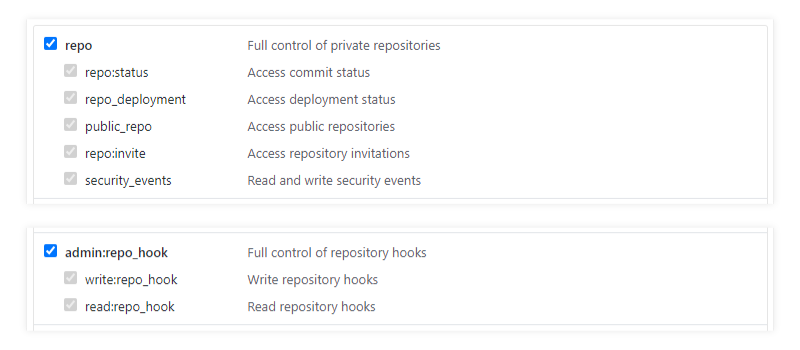

#  (WIP) AWS Transmutation CD Pipeline

 [](https://app.bors.tech/repositories/3)

> A Modern Multi-Purpose Continuous Deployment Pipeline Template for AWS

__Help needed fine tuning permissions!__

## Why Transmute?

Stop wasting time with the aws web console and manage your own build + deployment straight from your project repo. Reuse the same pipeline template for all your projects. Never release broken code with integrated CD using [AWS CodePipeline](https://aws.amazon.com/codepipeline/). 👋 Join the alchemists and focus on turning your user experience to gold! 🥇

- Develop on __GitHub__
- Automatic github __Status Updates__
- No-hastle __Continuous Deployment__ solution
    - Configure pipelines once
    - All project specific build commands live in your repo. Use aws CLI for deployment!
- Use the __Same Pipeline Template__ for individual branches
    - For example, configure for testing and run `staging` branch CI
    - For example, configure for deployment and run `master` branch CD
    - For example, configure CI on `staging` / `trying` and CD on `master` and develop using a merge bot like [Bors-NG](https://bors.tech/). Your code only deploys when merged pull requests pass CI tests!
- Keep production environment safe by separating testing and production pipelines on __Separate AWS Accounts__

## The Developer's Dream

> Write code and seamlessly automate testing and deployment.

### Piece of cake 🍰 with AWS Transmutation Pipeline. Take a look at this example production setup:

- __Minimum Effort__ deployment from pull requests. Everything else is automatic!
- __Pull Request Continuous Integration with [Bors-NG](https://bors.tech/):__ Merges to `master` & deployments only happen when your tests succeed!
- __Never release broken builds!__ Full integration testing of stack before deployment


## Separate Testing and Production environments for safety

Every pipeline is a separate entity! Keep your deployment pipeline on a production AWS account and all your testing on accounts you can afford to accidentally mess stuff up in! All cross cumminication happens withing git enabled by status updates.

## Forget local development. Try live development!

Local development can be hit or miss. It's not always possible to perfectly replicate AWS on your local machine, and often requires paid tools like [localstack](https://localstack.cloud/) to do so accurately.

With a pipeline template it becomes possible for anyone to easily launch their own pipeline and automate test deployment. Any developer sets up a Transmutation pipeline on their own account and configure it to deploy a specific development git branch. Commit changes and wait for build to succeede (or not)! Cheapen and simplify the way your develop.

## Getting Started

1. Fork the example repo located at https://github.com/MarcGuiselin/aws-transmutation-starter
1. Create GitHub OAuth Token
    
    > General instructions for creating a GitHub OAuth token can be found [here](https://help.github.com/en/github/authenticating-to-github/creating-a-personal-access-token-for-the-command-line)
    
    > When you get to the scopes/permissions page, you should select the "repo" and "admin:repo_hook" scopes, which will automatically select all permissions under those two scopes

    

1. This project will have CI on `staging` and `trying` (for Bors-NG) and CD on `master` for production, so we will create a pipeline for each. You can skip `trying` if you are not using a merge bot like Bors-NG.
    
    - Launch Transmutation Pipeline Stack for `master` using the button below.

        [](https://console.aws.amazon.com/cloudformation/home#/stacks/new?stackName=aws-transmutation-starter-master-pipeline&templateURL=https://s3.amazonaws.com/aws-transmutation-pipeline/template.yaml)

        1. Click __Next__
        1. Rename __Pipeline Configuration Name__ to `my-transmutation-starter-master-pipeline`
        1. Rename __Deploy Stack Name__ to `my-transmutation-starter-master-stack`
        1. Select __Stage__ `prod`
        1. Select __Features__ `Build > Deploy`
        1. Input your __GitHub OAuth Token__
        1. Input the __Repo Owner / Name__ for your forked repository
        1. Input `master` for your __Branch__
        1. We want to load the parameters for production deployment, so rename __CloudFormation Template Configuration__ to `prod-configuration.json`
        1. Click __Next__
        1. Click __Next__ again
        1. Acknowledge __Access Capabilities__
        1. Click __Create stack__
    
    - Launch Transmutation Pipeline Stack for `staging` using the button below.

        [](https://console.aws.amazon.com/cloudformation/home#/stacks/new?stackName=aws-transmutation-starter-staging-pipeline&templateURL=https://s3.amazonaws.com/aws-transmutation-pipeline/template.yaml)

        1. Click __Next__
        1. Rename __Pipeline Configuration Name__ to `my-transmutation-starter-staging-pipeline`
        1. Rename __Deploy Stack Name__ to `my-transmutation-starter-staging-stack`
        1. Select __Features__ `Build > Deploy > Integration > Cleanup`
        1. Input your __GitHub OAuth Token__
        1. Input the __Repo Owner / Name__ for your forked repository
        1. Input `staging` for your __Branch__
        1. Click __Next__
        1. Click __Next__ again
        1. Acknowledge __Access Capabilities__
        1. Click __Create stack__
    
    - Launch Transmutation Pipeline Stack for `trying` using the button below. (optional)

        [](https://console.aws.amazon.com/cloudformation/home#/stacks/new?stackName=aws-transmutation-starter-trying-pipeline&templateURL=https://s3.amazonaws.com/aws-transmutation-pipeline/template.yaml)

        1. Click __Next__
        1. Rename __Pipeline Configuration Name__ to `my-transmutation-starter-trying-pipeline`
        1. Rename __Deploy Stack Name__ to `my-transmutation-starter-trying-stack`
        1. Select __Features__ `Build > Deploy > Integration > Cleanup`
        1. Input your __GitHub OAuth Token__
        1. Input the __Repo Owner / Name__ for your forked repository
        1. Input `trying` for your __Branch__
        1. Click __Next__ 
        1. Click __Next__ again
        1. Acknowledge __Access Capabilities__
        1. Click __Create stack__ 

1. Install Bors-NG (optional)
    - [Give Bors access to your repo](https://github.com/apps/bors/installations/new/permissions?target_id=24906387)
    - Select `Only select repositories`
    - Select your forked repository
    - Click __Install__
    > You can also [Setup your own Bors-NG instance](https://github.com/bors-ng/bors-ng#how-to-set-up-your-own-real-instance)

1. Clone your repo locally and create a `staging` branch
1. Write some changes and commit
1. Create a pull request on GitHub
1. Confirm with Bors?

## Develop With Git Branches

Shift to the `staging` > `master` model of development. Develop on the `staging` branch and merge releases into `master` with pull requests. [Bors-NG](https://bors.tech/) is a popular tool that lets you automate this.

When you are ready, create a pull request. [Bors](https://bors.tech/) will run build, unit, and integration tests using in instance of Transmutation Pipeline configured for _integration testing_. Upon successful completion of tests [Bors](https://bors.tech/) will finalize the merge.

Once a new release makes it to `master`, the _production pipeline_ will kick into gear and deploy your code to production.

> __Pro Tip:__ Although it isn't built-in to Transmutation (yet), it's wise to configure [manual confirmation](https://docs.aws.amazon.com/codepipeline/latest/userguide/approvals.html) of test deployments before they are cleaned up. Send an email to the head of your team, or post a status on github so someone can manually confirm everything looks good before letting the pipeline succeed and deployment subsequently occur.

## Why Bors?

"Bors is a GitHub bot that prevents [merge skew / semantic merge conflicts](https://bors.tech/essay/2017/02/02/pitch/), so when a developer checks out the main branch, they can expect all of the tests to pass out-of-the-box."

What that means for you is that your `master` branch will always contain working, deployment-ready code. You can then configure a Transmutation Pipeline to deploy changes to `master` once they pass all tests and are merged. Your users will never experience broken releases!

## Recommended Project Structure

````yaml
my-transmutation-repo
├ src, web, or whatever!  # Develop a static site development top level, or organize every part of your project in folders to your pleasing
├ backend                 # Keep code for backend stuff like apis, ec2 stuff, database creation templates and such here.
│ ├ Serverless functions     
│ ├ Database templates
│ └ ...
├ testing                 # Keep tests in their own folder
│ ├ Unit tests
│ └ Integration tests
├ template.yaml           # Cloudformation template for whole project
├ build.yaml              # Build commands. For example: build production static site, do unit tests
├ deploy.yaml             # Deploy commands. For example: upload s3 site content, update SQL database structure
├ integ.yaml              # Integration test commands. For example: perform api tests with postman, test website contact form
├ cleanup.yaml            # Cleanup after staging/testing. For example: empty s3 buckets so they can be deleted
└ prod-configuration.json # Configure CloudFormation parameters for production builds
````

## Environment Variables

All pipeline steps are executed using AWS CodeBuild virtual containers that will run respective `yaml` files. Your commands will have access to the following environment variables:

- `PIPELINE_BUCKET` = name of artifact bucket
- `PIPELINE_STAGE` = either `prod` or `test`
- `PIPELINE_STACK_NAME` = name of the stack we are deploying to
- load more from `prod.env` or `test.env` files with the command `export $(cat $PIPELINE_STAGE.env | xargs)`

## Configuring differences in prod and test deployments

Say you want to release your production to a real domain, but don't want to deploy test builds to that same domain as well!

Instead of hard coding values like a domain name in your template, use CloudFormation [Parameters](https://docs.aws.amazon.com/AWSCloudFormation/latest/UserGuide/parameters-section-structure.html) and [Conditions](https://docs.aws.amazon.com/AWSCloudFormation/latest/UserGuide/conditions-section-structure.html). Then use `test-configuration.json` and `prod-configuration.json` files to set different parameters for test and prod builds. Transmutation is configured to optionally use these files during template changeset creation/execution. 

For example, [aws-transmutation-starter](https://github.com/MarcGuiselin/aws-transmutation-starter) if you don't set `Domain`, the template will output the cloudfront distribution url to the static website and api. However, if you set a `Domain` the template will configure a Route53 to the domain and link our static site and api through it.

## Using template outputs

There are many ways to get outputs from your template, but the most straight forward method gets outputs using the aws cli and export the output as an environment variable like so:

```yaml
phases:
  install:
    commands:
      # Get output 'ApiUrl' as an environment variable
      - >
        export API_URL="$( \
          aws cloudformation describe-stacks \
            --stack-name $PIPELINE_STACK_NAME \
            --query "Stacks[0].Outputs[?OutputKey=='ApiUrl'].OutputValue" \
            --output text \
        )"
```

## Common Questions:

### Q: How do I change/delete my pipeline now that my code is in production?

__A:__ Find your pipeline stack and delete it. This won't affect your production stack. You can then create your own custom pipeline or recreate a Transmutation Pipeline using the same name and branch.

## Thanks

[@honglu](https://github.com/honglu) [@jamesiri](https://github.com/jamesiri) [@jlhood](https://github.com/jlhood) and [everyone else](https://github.com/awslabs/aws-sam-codepipeline-cd/graphs/contributors) involved in the development of [AWS SAM CodePipeline CD](https://github.com/awslabs/aws-sam-codepipeline-cd).

[@jenseickmeyer](https://github.com/jenseickmeyer)'s project [github-commit-status-bot](https://github.com/jenseickmeyer/github-commit-status-bot) which heavily inspired the design of github-status-update.

## Donate

🍻 If you use or enjoy my work [buy me a drink](https://www.paypal.me/marcguiselin/3USD) or show your support by staring this repository. Both are very appreciated! 

## License and Copyright

Please see the LICENSE for an up to date copy of the copyright and license for the entire project. If you make a derivative project off of mine please let me know! I'd love to see what people make with my work!
